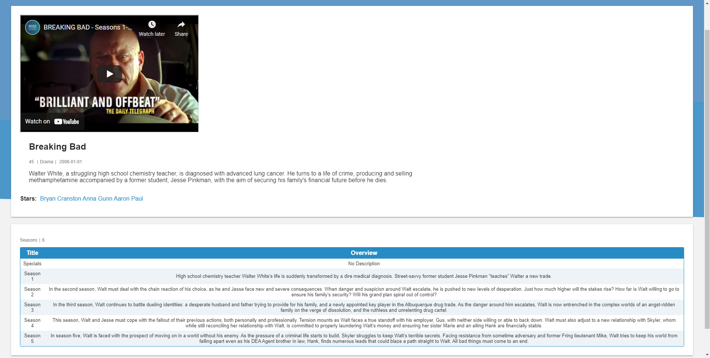

# MovieSeries

MovieSeries is a imdb like web app. Here you can find all kind of series.
You can search for most rated shows, filter them by rating, name, runtime or year,
in an ascending or descending order. 
Find actors, and see more information about them like in what movies did they play and what was their character name,
link to the series they've played in.

The design has been already made,
there is also a database that is ready (thanks to
[trakt.tv](https://trakt.tv/)).

## Home page

   

## Most Rated shows

   

## Single shows information

   

## All actors page

   

## Actor's page

   

